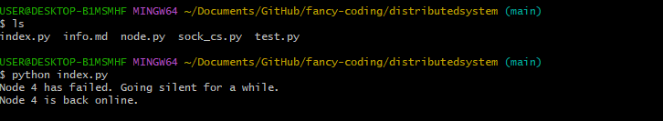

Implement the decentralized mutual exclusion algorithm for one shared critical section with at least 5nodes on different machines.Each node requests in random intervals access to a virtual sharedresource aka the critical section. Upon receiving access it willuse the resource for a couple of seconds before releasing itagain.Try to built a resilient decentralized access system thatguarantees exclusive access to the critical section in bothfailures scenarios.

- It requires to implement an algorithm and try to make it fail proof.It is not expected to make the system 100% fail proof, especially with
both message and node's failure.Node failure[fail-stop[return]] alone should be handled correctly.The combination with losing messages
should be handled as good as possible.It is required to consider and demonstrate two scenarios with stimulated failure

a)  one fail stop failures of node occur.Every node should have a certain probability to fail over an interval of time(e.g the probability that
one node fail after 30 seconds should be 90%).A failed node should go silent and should not produce any message nor process any received 
message for a random time interval(Choose appropriate upper and lower limits).Each failure has a lower chance of of being permanent(
    fail-stop instead of fail-stop-return
) Failures happen independtly, so there is possible that a second node fails while first one is down.
b) Additional to node failures, Messages might get lost(simulated by executing any send operation with a certain probabilities e.g 95%)
Make sure to apply all this possible failure to all messages send

- Ricart-agrawala algorithm

1. Decentralized Mutual Exclusion Algorithm:
   - This means that each node (machine) should be able to request and obtain exclusive access to a critical section without relying on a central authority.
   - A mutual exclusion algorithm ensures that only one node can access the critical section at any given time.

2. Five Nodes on Different Machines:
   - You need to implement this algorithm for a network of at least five nodes, each running on a separate machine.
   - These nodes will communicate with each other to coordinate access to the shared critical section.

3. Random Interval Requests:
   - Each node will randomly send requests to access the critical section at different intervals.
   - This simulates a real-world scenario where nodes may need access at unpredictable times.

4. Shared Resource (Critical Section):
   - The critical section is a part of the code where only one node can execute at a time.
   - In your case, it's a virtual shared resource that each node wants exclusive access to.

5. Use and Release Resource:
   - When a node successfully obtains access to the critical section, it should use the resource for a certain period (a few seconds) before releasing it.
   - This mimics the idea that a node performs some critical operations and then gives up control.

6. Resilient Decentralized Access System:
   - The system needs to be resilient to failures. There are various types of failures to consider, such as node crashes or network partitions.
   - The goal is to ensure that even in the presence of failures, the system guarantees exclusive access to the critical section.

7. Guarantee Exclusive Access in Failure Scenarios:
   - This means that even if some nodes fail or the network experiences issues, the system should still prevent multiple nodes from accessing the critical section simultaneously.

### Node Failures:

a) Fail-Stop Failures:
   - Each node should have a probability of failing over a given interval. Let's say the probability of a node failing after 30 seconds is 90%.
   - A failed node should go silent and not produce or process any messages for a random time interval. You can define an upper and lower limit for this interval. For example, the node might stay silent for a random time between 1 minute and 5 minutes.
   - This silent period simulates the downtime of a failed node, during which it cannot participate in the mutual exclusion algorithm.

Handling Failures:
   - Implement a failure detection mechanism. Nodes can periodically exchange heartbeat messages to check if other nodes are still alive.
   - If a node doesn't receive a heartbeat from another node within a certain timeout period, it can consider that node as failed.
   - When a node detects a failure, it should exclude the failed node from the mutual exclusion algorithm until it comes back online.

b) Independent Failures:
   - Since failures are independent, it's possible for multiple nodes to fail simultaneously.
   - When a node detects a failure, it should handle it and continue the execution of the mutual exclusion algorithm with the remaining nodes.

### Message Loss:

a) Lost Messages:
   - Simulate message loss by executing any send operation with a certain probability. For example, there's a 95% probability that a message might be lost during transmission.
   - Implement acknowledgment mechanisms to ensure that the sender knows whether a message was successfully received by the recipient.

Handling Message Loss:
   - If a node doesn't receive an acknowledgment within a specified timeout period, it should consider the message as lost and resend it.
   - Ensure idempotence in your message handling to handle cases where a message is received multiple times.

